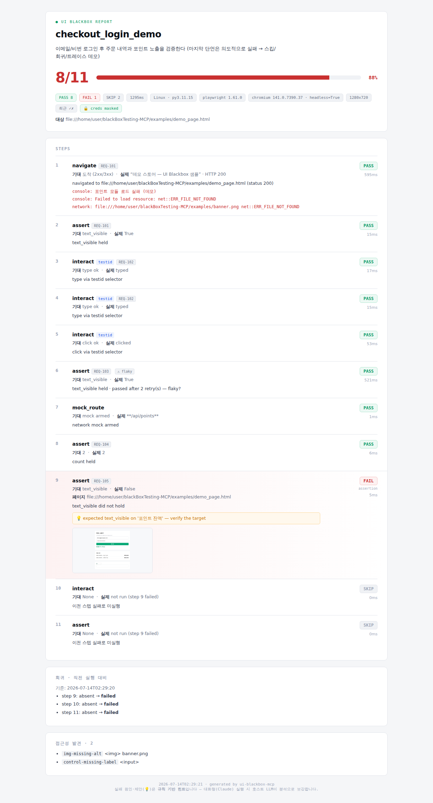

# UI Blackbox Tester MCP

**🌐 언어:** [English](./README.md) · **한국어**

> **자연어로 UI를 테스트하는 MCP 서버.** Claude Desktop(과 다른 MCP 클라이언트)에
> 브라우저 조작 능력을 붙여, 테스트 코드 없이 *"로그인 흐름이 되는지 확인해줘"* 라고
> 말하면 에이전트가 직접 브라우저를 열고 클릭·입력·검증한 뒤 **QA용 리포트(HTML/MD/JSON)**를
> 남긴다.

<p align="center">
  
  <br><em>자동 생성된 리포트 — 통과율·스텝별 스크린샷·실패 원인·회귀·접근성·자격증명 마스킹</em>
</p>

Python 3.11+ · Playwright(Chromium, async) · MCP 공식 SDK(FastMCP) · stdio · **테스트 76건 green**

---

## ✨ 무엇이 다른가 (vs 일반 Playwright MCP)

브라우저 조작만 하는 도구는 많다. 이 프로젝트는 **QA 워크플로**에 초점을 둔다.

| | 일반 브라우저 MCP | **UI Blackbox MCP** |
|---|---|---|
| 시나리오 작성 | 셀렉터를 직접 작성 | **자연어 → 키트 → 재사용 시나리오 생성**(`generate_scenario`) |
| 재사용 | 매번 새로 | **이름 붙여 저장·로드**(시나리오 라이브러리) |
| 결과 | 텍스트/로그 | **QA 리포트**: 통과율·스텝 스크린샷·**AI 실패 원인·수정 제안**·**회귀 비교**·**접근성 발견**·심각도 |
| 셀렉터 안정성 | 빌드마다 깨짐 | **D2 우선순위 체인**(data-testid→role+name→text→css) + `resolved_by` 투명성 |
| 보안 | — | **자격증명 마스킹**(`${VAR}` env 주입, 리포트 비노출) |

→ 개발자 도구가 아니라 **비개발 QA/기획자도 자연어로 쓰는 회귀 테스트 자동화**.

---

## 🚀 빠른 시작

### 1) 설치
```bash
git clone https://github.com/WindowHyun/blackBoxTesting-MCP.git
cd blackBoxTesting-MCP

python -m venv .venv
.venv/bin/pip install -e .              # 의존성(mcp, playwright) 설치
.venv/bin/playwright install chromium   # 브라우저(최초 1회). 생략 시 서버 첫 실행에 자동 설치
```
> 사내/CI 등 브라우저 CDN이 막힌 환경은 사전설치 바이너리를 쓰도록
> `CHROMIUM_EXECUTABLE=/path/to/chrome` 환경변수를 지정하면 된다.

아래 설정에서 `<ABS>`는 이 저장소의 **절대경로**로 바꾼다. 예:
`/home/you/blackBoxTesting-MCP`. Windows의 인터프리터는
`<ABS>\.venv\Scripts\python.exe`.

---

## 🔌 클라이언트 설정

서버는 **stdio**로 동작하므로 모든 MCP 클라이언트가 같은 방식으로 띄운다 — venv의
Python으로 `-m blackbox_mcp.server`를 실행. 클라이언트마다 **설정 파일/형식만** 다르다.
본인 것을 고르면 된다.

<details open>
<summary><b>Claude Desktop</b></summary>

설정 파일을 연다(없으면 생성):
- macOS: `~/Library/Application Support/Claude/claude_desktop_config.json`
- Windows: `%APPDATA%\Claude\claude_desktop_config.json`

```json
{
  "mcpServers": {
    "ui-blackbox": {
      "command": "<ABS>/.venv/bin/python",
      "args": ["-m", "blackbox_mcp.server"],
      "env": {
        "HEADLESS": "true",
        "REPORT_DIR": "<ABS>/reports"
      }
    }
  }
}
```
Claude Desktop을 재시작. 이후 대화에서: *"https://example.com/login 열어서 로그인 흐름 테스트하고 리포트 만들어줘"*
</details>

<details>
<summary><b>Claude Code / Claude CLI</b> (동일 제품 — <code>claude</code> CLI)</summary>

가장 쉬운 방법 — 명령 한 줄(user 스코프, 모든 프로젝트에서 사용 가능):
```bash
claude mcp add ui-blackbox \
  --scope user \
  --env HEADLESS=true \
  --env REPORT_DIR=<ABS>/reports \
  -- <ABS>/.venv/bin/python -m blackbox_mcp.server
```
`claude mcp list` 로 확인 → `ui-blackbox`가 보이면 성공.

저장소에 함께 커밋하려면 루트에 프로젝트 스코프 **`.mcp.json`**을 둔다:
```json
{
  "mcpServers": {
    "ui-blackbox": {
      "command": "<ABS>/.venv/bin/python",
      "args": ["-m", "blackbox_mcp.server"],
      "env": { "HEADLESS": "true", "REPORT_DIR": "<ABS>/reports" }
    }
  }
}
```
</details>

<details>
<summary><b>Codex CLI</b></summary>

명령 한 줄:
```bash
codex mcp add ui-blackbox \
  --env HEADLESS=true --env REPORT_DIR=<ABS>/reports \
  -- <ABS>/.venv/bin/python -m blackbox_mcp.server
```
또는 `~/.codex/config.toml`을 직접 편집(JSON이 아니라 TOML):
```toml
[mcp_servers.ui-blackbox]
command = "<ABS>/.venv/bin/python"
args = ["-m", "blackbox_mcp.server"]

[mcp_servers.ui-blackbox.env]
HEADLESS = "true"
REPORT_DIR = "<ABS>/reports"
```
</details>

<details>
<summary><b>Gemini CLI</b></summary>

`~/.gemini/settings.json`을 편집:
```json
{
  "mcpServers": {
    "ui-blackbox": {
      "command": "<ABS>/.venv/bin/python",
      "args": ["-m", "blackbox_mcp.server"],
      "env": { "HEADLESS": "true", "REPORT_DIR": "<ABS>/reports" },
      "timeout": 30000
    }
  }
}
```
`env` 값은 셸 환경변수를 `$VAR` / `${VAR}`로 참조할 수 있다. Gemini CLI 안에서 `/mcp`로 연결을 확인한다.
</details>

<details>
<summary><b>Google Antigravity</b> (IDE & CLI)</summary>

Antigravity(IDE + CLI)는 MCP 설정을 한 파일에서 공유한다: `~/.gemini/config/mcp_config.json`.
IDE에서는 에이전트 패널 상단 **⋯** 메뉴 → **MCP Servers → Manage MCP Servers →
View raw config**로 직접 열 수 있다.

```json
{
  "mcpServers": {
    "ui-blackbox": {
      "command": "<ABS>/.venv/bin/python",
      "args": ["-m", "blackbox_mcp.server"],
      "env": { "HEADLESS": "true", "REPORT_DIR": "<ABS>/reports" }
    }
  }
}
```
파일을 저장하면 Antigravity가 서버를 자동으로 다시 로드한다.
</details>

> **모든 클라이언트 공통 팁.** `command`에는 **venv Python 절대경로**를 쓴다(시스템
> Python 의존성 충돌 회피). MCP 서버의 cwd가 시스템 경로일 수 있으므로 **`REPORT_DIR`을
> 절대경로로 지정**한다 — 미지정 시 `~/ui-blackbox/reports`로 폴백한다. 아래 슬래시
> 명령은 Claude 전용이며, 다른 클라이언트는 같은 도구를 자연어로 호출한다.

---

## ⌨️ 슬래시 명령 (Claude — 권장, 다른 브라우저 도구와 충돌 방지)

Claude 입력창에 `/`를 치면 아래 명령이 뜬다. **ui-blackbox 도구만 쓰도록 자동 지시**되어,
"Claude in Chrome" 같은 다른 브라우저 도구가 가로채는 걸 막는다.

| 명령 | 인수 | 용도 |
|---|---|---|
| `/ui-test` | task | 자연어 작업을 ui-blackbox 도구로 수행 |
| `/ui-scenario` | description, url | 시나리오 구성→실행→리포트(all) |
| `/ui-login` | task, url | **실제 크롬(로그인 유지)으로 전환** 후 로그인 필요한 사이트 테스트 |
| `/ui-generate` | description, url, name | 페이지 분석→재사용 시나리오 생성·저장 |

예: `/ui-test` → `네이버 열어서 로그인 버튼 클릭하고 스크린샷 찍어줘`

## 💬 사용 예 (자연어)
- *"이 페이지에서 회원가입 폼이 빈 값일 때 에러 뜨는지 확인해줘"*
- *"로그인 시나리오를 만들어서 'smoke_login'으로 저장해줘"* → 다음부턴 *"smoke_login 돌려줘"*
- *"방금 테스트, 어제 대비 뭐가 깨졌어?"* (회귀 비교)
- *"콘솔 에러랑 4xx 응답 있었어?"*

---

## 🧰 MCP Tools (19)

| 그룹 | Tool |
|---|---|
| 코어 | `navigate` · `snapshot`(a11y/dom) · `screenshot` · `interact` · `assert_` · `get_console_logs` · `get_network_errors` |
| 확장 | `wait` · `switch_frame` · `expect_dialog` · `reset_session` · `use_real_browser` · `dismiss_banners` |
| 시나리오·리포트 | `run_scenario` · `generate_scenario` · `save_report` |
| 라이브러리 | `save_scenario` · `load_scenario` · `list_scenarios` |

> **모든 테스트 흐름은 리포트로 끝난다.** 임의 도구 호출(navigate/interact/assert…)은
> 자동 기록되고, 마지막에 `save_report`가 JSON/MD/HTML 리포트를 남긴다(슬래시 명령은
> 이를 자동 지시). `run_scenario`는 자체적으로 리포트를 저장한다.

> **Tool 추가 = `tools/`에 파일 1개 + import 한 줄.** `server.py`는 수정하지 않는다.

---

## 🧪 리포트
실제 산출물은 [`examples/`](./examples/) 참고 (`sample_report.html`을 브라우저로 열면 됨).
단일 self-contained HTML(스크린샷 base64 내장, 외부 의존성 0) — 스텝별 결과·실패
스크린샷·AI 수정 제안·**회귀(직전 실행 대비)**·**접근성 발견**·환경 메타·마스킹 배지.

---

## 🏗️ 구조
```
blackbox_mcp/
  server.py        # FastMCP 부팅 + ensure_chromium + lifespan + register_all
  bootstrap.py     # Chromium 자동 설치 (D1)
  config.py        # 환경변수
  browser/         # 세션 싱글톤 · 이벤트 버퍼 · D2 셀렉터 체인
  testing/         # 시나리오 runner · 리포트(JSON/MD/HTML) · 라이브러리 · 마스킹
  tools/           # MCP Tool = 파일 1개 (레지스트리 자동 등록)
```
설계: [`DESIGN.md`](./DESIGN.md) · 마일스톤: [`ROADMAP.md`](./ROADMAP.md) ·
실행 플레이북: [`HARNESS.md`](./HARNESS.md) · 에이전트 컨텍스트: [`CLAUDE.md`](./CLAUDE.md)

---

## 🔧 개발
```bash
.venv/bin/pip install -e ".[dev]"
.venv/bin/python -m pytest -q        # 76건 (단위 + file:// 통합 + E2E)
```

## ⚙️ 환경변수
`HEADLESS`(기본 true) · `BROWSER`(chromium) · `CHROMIUM_EXECUTABLE` ·
`BROWSER_CHANNEL`(chrome/msedge — 실제 브라우저) · `BROWSER_CDP`(실행 중 브라우저 attach) ·
`STEALTH`(봇오탐 완화) · `REPORT_DIR`(기본 ~/ui-blackbox/reports) ·
`SCENARIO_DIR`(~/ui-blackbox/scenarios) · `SELECTOR_TIMEOUT_MS`(2000) ·
`DEFAULT_WAIT_UNTIL`(networkidle) · `NAV_TIMEOUT_MS`(30000) ·
`IGNORE_HTTPS_ERRORS`(false). 자세히는 `.env.example`.

> **실 배포 사이트 테스트 팁**: ① 광고/폴링 많은 사이트는 `networkidle`이 안 끝나
> 느릴 수 있다 — navigate는 타임아웃 시 **현재 상태로 진행**(`settled:false` 반환)하지만,
> `DEFAULT_WAIT_UNTIL=domcontentloaded`가 더 빠르다. ② 요소가 늦게 뜨면
> `SELECTOR_TIMEOUT_MS`를 5000~10000으로. ③ 광고·트래커의 4xx 노이즈는
> `get_network_errors(same_origin=True)`로 같은 도메인만 본다. ④ 쿠키 동의 배너는 `dismiss_banners`로 닫는다(클릭이 가려지면 자동 권유). ⑤ 로그인/봇월은
> `use_real_browser`. ⑥ 스테이징 인증서는 `IGNORE_HTTPS_ERRORS=true`.
> ⑦ **새 탭/팝업은 자동 추적**된다(클릭으로 새 창이 열리면 세션이 따라가고, 팝업이
> 닫히면 원래 탭으로 복귀 — OAuth 팝업 등).

> **봇 탐지 안내**: 이 도구는 **자신의 UI/스테이징 테스트**에 맞춰져 있다. 네이버 등
> 제3자 사이트는 안티봇으로 자동화를 막을 수 있고, 이를 우회한 로그인 자동화는 해당
> 서비스 약관 위반 소지가 있다. 정상 테스트의 오탐은 `BROWSER_CHANNEL=chrome` +
> `STEALTH=true`로 줄일 수 있다.

### 🔗 로그인이 필요한 사이트 — 실제 브라우저 (수동 설정 불필요)
**권장(자동):** 대화에서 `/ui-login` 또는 "실제 브라우저로 로그인해서 ~~"라고 하면
에이전트가 `use_real_browser` tool을 호출해 **실제 Chrome을 영구 프로필로 자동 실행**한다.
그 창에서 **처음 한 번만 직접 로그인**하면 프로필(`~/ui-blackbox/chrome-profile`)에
저장돼 다음 실행에도 유지된다. 번들 헤드리스보다 봇 탐지에 훨씬 덜 걸린다.
> 실제 Chrome이 없으면 자동으로 번들 브라우저로 폴백한다. `BROWSER_CHANNEL=msedge`
> 등으로 채널 지정 가능.

**고급(수동 CDP):** 이미 떠 있는 내 크롬에 붙이려면 디버그 포트로 실행 후
`BROWSER_CDP` 지정:
```bash
chrome --remote-debugging-port=9222 --user-data-dir="C:\cdp-profile"   # 그 창에서 로그인
```
config `env`: `"BROWSER_CDP": "http://localhost:9222"` → attach. 세션을 닫아도
**내 브라우저는 유지**된다.
