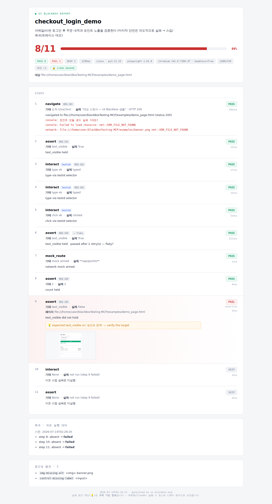

# UI Blackbox Tester MCP

**🌐 Language:** **English** · [한국어](./README.ko.md)

> **Test your UI in plain language — an MCP server.** Give Claude Desktop (and other
> MCP clients) the ability to drive a browser. Say *"check that the login flow works"*
> and the agent opens a browser, clicks, types, asserts, and leaves a **QA report
> (HTML/MD/JSON)** behind — no test code required.

<p align="center">
  
  <br><em>Auto-generated report — pass/fail/<b>skipped</b> · run <b>trend</b> · requirement <b>tags</b> · <b>flaky</b> retry marks · failure page/screenshot/suggestion · regression · accessibility · credential masking</em>
</p>

[](https://pypi.org/project/ui-blackbox-mcp/)
[](https://pypi.org/project/ui-blackbox-mcp/)

Python 3.11+ · Playwright (Chromium, async) · official MCP SDK (FastMCP) · stdio · **tests green in CI**

---

## ✨ What's different (vs a generic browser MCP)

Plenty of tools can drive a browser. This one is built around the **QA workflow**.

| | Generic browser MCP | **UI Blackbox MCP** |
|---|---|---|
| Authoring | Write selectors by hand | **Natural language → kit → reusable scenario** (`generate_scenario`) |
| Reuse | Start over each time | **Save & load by name** (scenario library) |
| Output | Text / logs | **QA report**: pass rate · step screenshots · **AI failure cause + fix suggestion** · **regression diff** · **a11y findings** · severity |
| Selector stability | Breaks every build | **D2 priority chain** (data-testid → role+name → text → css) + `resolved_by` transparency |
| Security | — | **Credential masking** (`${VAR}` injected from env, never written to reports) |

→ Not a developer tool, but **regression-test automation that non-developer QA/PMs can drive in natural language**.

---

## 🚀 Quick start

### 1) Install

**Option A — from PyPI, no clone (recommended).** `uvx` (Python's `npx`; ships with
[uv](https://docs.astral.sh/uv/)) fetches, isolates, and runs the
[`ui-blackbox-mcp`](https://pypi.org/project/ui-blackbox-mcp/) package in one step —
this is the whole Claude Desktop config, nothing else to set up:

```json
{
  "mcpServers": {
    "ui-blackbox": { "command": "uvx", "args": ["ui-blackbox-mcp"] }
  }
}
```

The same one-liner works for the CLI and for `pipx`/`pip` users:

```bash
uvx --from ui-blackbox-mcp ui-blackbox doctor
pipx install ui-blackbox-mcp    # or:
pip install ui-blackbox-mcp
```

Chromium auto-installs on the server's first run (or run `playwright install
chromium` once). To run the latest unreleased code instead, swap the package
name for `git+https://github.com/WindowHyun/blackBoxTesting-MCP.git`
(e.g. `uvx --from git+… ui-blackbox-mcp`).

**Option B — from a clone (development):**
```bash
git clone https://github.com/WindowHyun/blackBoxTesting-MCP.git
cd blackBoxTesting-MCP

python -m venv .venv
.venv/bin/pip install -e .              # installs deps (mcp, playwright)
.venv/bin/playwright install chromium   # browser (first time). Skipped? the server auto-installs on first run
```
> On networks where the browser CDN is blocked (corp/CI), point at a pre-installed
> binary with `CHROMIUM_EXECUTABLE=/path/to/chrome`.

Wherever a config below uses `<ABS>`, replace it with the **absolute path** of this
repo, e.g. `/home/you/blackBoxTesting-MCP`. On Windows the interpreter is
`<ABS>\.venv\Scripts\python.exe`. (With Option A, `uvx` replaces all of that.)

---

## 🔌 Client setup

The server speaks **stdio**, so every MCP client launches it the same way. With the
PyPI package the command is simply `uvx` + `ui-blackbox-mcp` (Option A above — works
in every client below by swapping the command). The sections below show the
clone+venv variant (`venv Python -m blackbox_mcp.server`); only the config
file/format differs per client. Pick yours.

<details open>
<summary><b>Claude Desktop</b></summary>

Edit the config file (create it if missing):
- macOS: `~/Library/Application Support/Claude/claude_desktop_config.json`
- Windows: `%APPDATA%\Claude\claude_desktop_config.json`

```json
{
  "mcpServers": {
    "ui-blackbox": {
      "command": "<ABS>/.venv/bin/python",
      "args": ["-m", "blackbox_mcp.server"],
      "env": {
        "HEADLESS": "true",
        "REPORT_DIR": "<ABS>/reports"
      }
    }
  }
}
```
Restart Claude Desktop. Then in chat: *"Open https://example.com/login, test the login flow and make a report."*
</details>

<details>
<summary><b>Claude Code / Claude CLI</b> (same product — the <code>claude</code> CLI)</summary>

Easiest — one command (user scope, available in every project):
```bash
claude mcp add ui-blackbox \
  --scope user \
  --env HEADLESS=true \
  --env REPORT_DIR=<ABS>/reports \
  -- <ABS>/.venv/bin/python -m blackbox_mcp.server
```
Verify with `claude mcp list` → it should show `ui-blackbox`.

Or, to commit it alongside a repo, drop a project-scoped **`.mcp.json`** at the repo root:
```json
{
  "mcpServers": {
    "ui-blackbox": {
      "command": "<ABS>/.venv/bin/python",
      "args": ["-m", "blackbox_mcp.server"],
      "env": { "HEADLESS": "true", "REPORT_DIR": "<ABS>/reports" }
    }
  }
}
```
</details>

<details>
<summary><b>Codex CLI</b></summary>

One command:
```bash
codex mcp add ui-blackbox \
  --env HEADLESS=true --env REPORT_DIR=<ABS>/reports \
  -- <ABS>/.venv/bin/python -m blackbox_mcp.server
```
Or edit `~/.codex/config.toml` directly (TOML, not JSON):
```toml
[mcp_servers.ui-blackbox]
command = "<ABS>/.venv/bin/python"
args = ["-m", "blackbox_mcp.server"]

[mcp_servers.ui-blackbox.env]
HEADLESS = "true"
REPORT_DIR = "<ABS>/reports"
```
</details>

<details>
<summary><b>Gemini CLI</b></summary>

Edit `~/.gemini/settings.json`:
```json
{
  "mcpServers": {
    "ui-blackbox": {
      "command": "<ABS>/.venv/bin/python",
      "args": ["-m", "blackbox_mcp.server"],
      "env": { "HEADLESS": "true", "REPORT_DIR": "<ABS>/reports" },
      "timeout": 30000
    }
  }
}
```
Values can reference shell env vars as `$VAR` / `${VAR}`. Run `/mcp` inside Gemini CLI to confirm the server connected.
</details>

<details>
<summary><b>Google Antigravity</b> (IDE & CLI)</summary>

Antigravity (IDE + CLI) share one MCP config: `~/.gemini/config/mcp_config.json`.
In the IDE you can open it via the **⋯** menu at the top of the agent panel →
**MCP Servers → Manage MCP Servers → View raw config**.

```json
{
  "mcpServers": {
    "ui-blackbox": {
      "command": "<ABS>/.venv/bin/python",
      "args": ["-m", "blackbox_mcp.server"],
      "env": { "HEADLESS": "true", "REPORT_DIR": "<ABS>/reports" }
    }
  }
}
```
Save the file and Antigravity reloads the server automatically.
</details>

> **Tips that apply to every client.** Use the **venv Python absolute path** for
> `command` (avoids system-Python dependency clashes). The MCP server's cwd may be a
> system path, so **set `REPORT_DIR` to an absolute path** or reports fall back to
> `~/ui-blackbox/reports`. Slash commands (below) are Claude-specific; other clients
> drive the same tools via natural language.

---

## ⌨️ Slash commands (Claude — recommended, avoids clashing with other browser tools)

Type `/` in Claude to see these. Each **instructs the agent to use only the
ui-blackbox tools**, so another browser tool (e.g. "Claude in Chrome") can't hijack
the request.

| Command | Args | Purpose |
|---|---|---|
| `/ui-test` | task | Run a natural-language task with the ui-blackbox tools |
| `/ui-scenario` | description, url | Build → run → report (all formats) |
| `/ui-login` | task, url | **Switch to real Chrome (persistent login)** then test a site that needs auth |
| `/ui-generate` | description, url, name | Analyze a page → generate & save a reusable scenario |
| `/ui-sync` | name, url | Change detection: diff a saved scenario against the current page, update & re-run |
| `/ui-loop` | name, app_log | **Autonomous loop, one cycle**: run → detect & recall → trace cause → dump the flow → propose a repair (gated) → verify regression |

Example: `/ui-test` → `open example.com, click the login button, take a screenshot`

## 💬 Usage examples (natural language)
- *"On this page, check that the signup form shows an error when fields are empty."*
- *"Make a login scenario and save it as 'smoke_login'."* → later: *"run smoke_login."*
- *"Compared to yesterday, what broke in that last test?"* (regression)
- *"Were there any console errors or 4xx responses?"*

### 🔁 The autonomous loop (`/ui-loop`)

One cycle chains everything above, with one hard rule at its centre.

| Stage | What runs |
|---|---|
| 1–2. prompt → automate | `load_scenario` → `run_scenario(continue_on_fail, snapshot_each, app_log)` |
| 3. detect + **recall** | failed steps carry `memory.status` = `new` / `recurring` / `regressed` (`get_failure_memory`) |
| 4. trace the cause | console+`pageerror` · network · dialogs · **`app_log` lines from the step's own time window** · screenshot → `diagnose_run` |
| 5. read the flow | per-step page outline (`snapshot_each`) + step screenshots |
| 6. repair — **gated** | `app_broken` / `environment` / `unknown` → **refuses**. Only `ui_changed` / `scenario_bug` reach `propose_repair`, which returns candidates and writes nothing |
| 7. verify | re-run → `regression` diff; the closed failure is marked resolved on the next clean run |

> **Why the gate exists.** A loop that repairs whatever is red converges on a
> green suite that asserts nothing. When the page threw or the server 5xx'd,
> rewriting the assertion until it passes deletes the defect. So the cause is
> classified from evidence *before* anything is proposed, and `propose_repair`
> refuses outright on anything but a genuine UI change.
>
> It also states its own blind spot: an element that still exists but whose
> assertion no longer holds ("the cart badge stopped updating") is
> structurally identical to a rename. That case is returned as
> `confidence: medium` + `requires_human_review: true` — never auto-applied.

---

## 🧰 MCP Tools (33)

| Group | Tools |
|---|---|
| Core | `navigate` · `snapshot` (a11y/dom) · `screenshot` · `interact` · `assert_` · `get_console_logs` · `get_network_errors` |
| Extended | `wait` · `switch_frame` · `expect_dialog` · `get_dialogs` · `reset_session` · `use_real_browser` · `dismiss_banners` · `status` |
| Popups & tabs | `expect_popup` · `list_tabs` · `switch_tab` — deterministic popup handling and a way back to the opener |
| Files | `interact(action="upload")` · `expect_download` — attachment upload, and download verified by name/extension/size |
| Autonomous loop | `get_failure_memory` · `diagnose_run` · `propose_repair` — is this failure new or chronic, what caused it, and is fixing the *test* even legitimate |
| Auth state | `save_state` · `load_state` · `list_states` — export login (cookies+localStorage) once, reuse headless/in CI, swap roles |
| Network mock | `mock_route` · `unmock_route` — deterministic offline responses for flaky/unbuilt APIs |
| Scenario & report | `run_scenario` (incl. `trace_on_failure`) · `generate_scenario` · `save_report` |
| Library | `save_scenario` · `load_scenario` · `list_scenarios` |

### 🎯 무엇을 잡고 무엇을 놓치는가

결함 6종을 심은 [defect lab](examples/defect-lab/)으로 탐지 범위를 실측했다.
**못 잡는 것까지 회귀 테스트로 고정**해 뒀다 — 커버리지를 조용히 부풀리거나 잃지 않도록.

| 결함 유형 | 결과 |
|---|---|
| 요소 상태 (담기 후 배지 미갱신) | ✅ 탐지 |
| 화면 전이 (입력이 조용히 사라져 체크아웃 실패) | ✅ 탐지 |
| 미처리 JS 예외 | ✅ 탐지 (`--fail-on-js-error`로 CI 게이트) |
| 잘못된 이미지 | ❌ 미탐지 — 시각 회귀 범위 밖 |
| 정렬 오동작 | ❌ 미탐지 — 순서 어서션 없음 |
| 2배 느린 렌더 | ⚠️ 측정만, 실패 아님 |

기준선 계정은 20/20 통과(오탐 0). 전체 기록:
[`docs/CASE-STUDY-defect-detection.md`](docs/CASE-STUDY-defect-detection.md)

> **Every test flow ends with a report.** Ad-hoc tool calls (navigate/interact/assert…)
> are recorded automatically, and a final `save_report` writes the JSON/MD/HTML report
> (slash commands instruct this automatically). `run_scenario` saves its own report.

> **Adding a tool = 1 file in `tools/` + 1 import line.** `server.py` is never touched.

---

## 🖥️ CLI / CI (no MCP client needed)

Scenarios you built in chat can be replayed headlessly in a pipeline — same
runner, same reports, plus an exit code and JUnit XML:

```bash
ui-blackbox run smoke_login                     # library scenario → exit 0/1
ui-blackbox run ./steps.json --format all       # a steps .json file
ui-blackbox run a b c --junit results.xml       # suite + JUnit for CI
ui-blackbox run a b c --parallel 3              # one isolated subprocess each
ui-blackbox run a b c --parallel 3 --timeout 300  # per-scenario watchdog (sec)
ui-blackbox run smoke --trace-on-failure        # keep a Playwright trace.zip only on failure
ui-blackbox doctor                              # browser/dirs/config self-check
```

GitHub Actions sketch:
```yaml
- run: pip install . && playwright install chromium
- run: ui-blackbox run smoke_login --junit results.xml
- uses: actions/upload-artifact@v4
  with: { name: ui-reports, path: ~/ui-blackbox/reports }
```
Exit codes: `0` all passed · `1` a step failed · `2` usage/infra error.
In chat, the `status` tool reports version/mode/liveness for debugging.

**Good to know:**
- `navigate` **fails on HTTP ≥ 400** (a 500/404 is not a green step). Add
  `"expect_status": 404` to a step to assert an error page on purpose.
- Failure `reason`/`suggestion` in a CLI report are **rule-based hints**; in
  chat, Claude (the host LLM) enriches them with real analysis.
- The server is **single-tenant** — one browser/session per process. True
  parallelism is via `--parallel` (one subprocess per scenario), not a shared
  server.

---

## 🧪 Reports
See [`examples/`](./examples/) for real output (open `sample_report.html` in a browser).
A single self-contained HTML (screenshots inlined as base64, zero external deps) —
per-step results · failure screenshots · AI fix suggestions · **regression (vs the
previous run)** · **a11y findings** · environment metadata · masking badges.

---

## 🏗️ Structure
```
blackbox_mcp/
  server.py        # FastMCP boot + ensure_chromium + lifespan + register_all
  bootstrap.py     # Chromium auto-install (D1)
  config.py        # environment variables
  browser/         # session singleton · event buffers · D2 selector chain
  testing/         # scenario runner · report (JSON/MD/HTML) · library · masking
  tools/           # MCP tool = 1 file (registry auto-registers)
```
Design: [`DESIGN.md`](./DESIGN.md) · Milestones: [`ROADMAP.md`](./ROADMAP.md) ·
Run playbook: [`HARNESS.md`](./HARNESS.md) · Agent context: [`CLAUDE.md`](./CLAUDE.md)

---

## 🔧 Development
```bash
.venv/bin/pip install -e ".[dev]"
.venv/bin/python -m pytest -q                    # full suite (unit + file:// integration + E2E)
.venv/bin/python -m pytest -q -m "not browser"   # fast unit lane, no browser needed
```

## ⚙️ Environment variables
`HEADLESS` (default true) · `BROWSER` (chromium) · `CHROMIUM_EXECUTABLE` ·
`BROWSER_CHANNEL` (chrome/msedge — real browser) · `BROWSER_CDP` (attach to a running browser) ·
`STEALTH` (reduce bot false-positives) · `REPORT_DIR` (default ~/ui-blackbox/reports) ·
`SCENARIO_DIR` (~/ui-blackbox/scenarios) · `SELECTOR_TIMEOUT_MS` (2000) ·
`DEFAULT_WAIT_UNTIL` (networkidle) · `NAV_TIMEOUT_MS` (30000) ·
`IGNORE_HTTPS_ERRORS` (false) · `REPORT_RETENTION` (keep newest N runs,
default 100, 0=unlimited) · `VIEWPORT` (e.g. `1280x800`, `390x844` for mobile) ·
`DOWNLOAD_DIR` (~/ui-blackbox/downloads) · `BROWSER_INSTALL_TIMEOUT_S` (300) ·
`APP_LOG` (server/app log file correlated to the step that was running).
Details in `.env.example`.

### Closed / corporate networks (사내망)
| Variable | Purpose |
|---|---|
| `PROXY_SERVER` | Proxy for **browser traffic**, e.g. `http://proxy.corp:8080`. Falls back to `HTTPS_PROXY`/`HTTP_PROXY`. Chromium ignores the OS/env proxy on some platforms and never picks up its credentials, so set this explicitly. |
| `PROXY_USERNAME` / `PROXY_PASSWORD` | Authenticating proxy. Without them the browser raises a native auth dialog no automation can answer. |
| `PROXY_BYPASS` | Comma list of hosts to reach directly (falls back to `NO_PROXY`). |
| `HTTP_USERNAME` / `HTTP_PASSWORD` | HTTP Basic/Digest auth, common on internal staging. |
| `AUTH_SERVER_ALLOWLIST` | Hosts Chromium may auto-negotiate **NTLM/Kerberos SSO** with, e.g. `*.corp.example.com`. |
| `IGNORE_HTTPS_ERRORS` | Accept an internal CA / self-signed / SSL-inspection certificate. |
| `CHROMIUM_EXECUTABLE` | Use a browser installed out of band when `cdn.playwright.dev` is blocked. |
| `BROWSER_INSTALL_TIMEOUT_S` | Cap the first-run browser download (default 300s) so a blackholed CDN can't hang startup. |

Verify the whole chain before writing scenarios:

```bash
ui-blackbox doctor --url https://intranet.corp.example.com
#   network:
#     proxy: http://proxy.corp:8080 +auth
#     auth_server_allowlist (NTLM/Kerberos): *.corp.example.com
#     reach https://intranet.corp.example.com: ✓ HTTP 200 “사내 포털”
```

> **Testing live/deployed sites.** ① Ad/polling-heavy sites may never reach
> `networkidle` — navigate proceeds on timeout (`settled:false`), and
> `DEFAULT_WAIT_UNTIL=domcontentloaded` is faster. ② For slow-appearing elements,
> raise `SELECTOR_TIMEOUT_MS` to 5000–10000. ③ Filter ad/tracker 4xx noise with
> `get_network_errors(same_origin=True)`. ④ Cookie-consent banners: `dismiss_banners`
> (auto-suggested when a click is blocked). ⑤ Login/bot-walls: `use_real_browser`.
> ⑥ Staging certs: `IGNORE_HTTPS_ERRORS=true`. ⑦ **New tabs/popups are tracked
> automatically** (the session follows a click that opens a new window and returns to
> the original tab when the popup closes — e.g. OAuth popups). When the **next step
> asserts on the popup**, use `expect_popup` instead of a bare click: Chromium only
> announces a popup once it has committed its navigation, so a plain click races it.
> `list_tabs` / `switch_tab` go back to the opener. ⑧ Nested iframes: chain the
> selectors — `switch_frame("#outer >>> #inner")`.

> **About bot detection.** This tool targets **your own UI / staging**. Third-party
> sites may block automation with anti-bot measures, and bypassing those for login
> automation can violate their terms of service. False-positives on legitimate tests
> can be reduced with `BROWSER_CHANNEL=chrome` + `STEALTH=true`.

### 🔗 Sites that require login — real browser (no manual setup)
**Recommended (automatic):** say `/ui-login` or *"log in with a real browser and …"*
and the agent calls the `use_real_browser` tool to **launch real Chrome with a
persistent profile**. Log in **once, by hand**, in that window; the profile is saved
to `~/ui-blackbox/chrome-profile` and reused on later runs. Far less likely to trip
bot detection than the bundled headless browser.
> If real Chrome isn't found, it falls back to the bundled browser automatically. Pin
> a channel with `BROWSER_CHANNEL=msedge`, etc.

**Advanced (manual CDP):** to attach to a Chrome you already have open, launch it with
a debug port and set `BROWSER_CDP`:
```bash
chrome --remote-debugging-port=9222 --user-data-dir="C:\cdp-profile"   # log in there
```
config `env`: `"BROWSER_CDP": "http://localhost:9222"` → attach. Closing the session
**leaves your browser open**.
